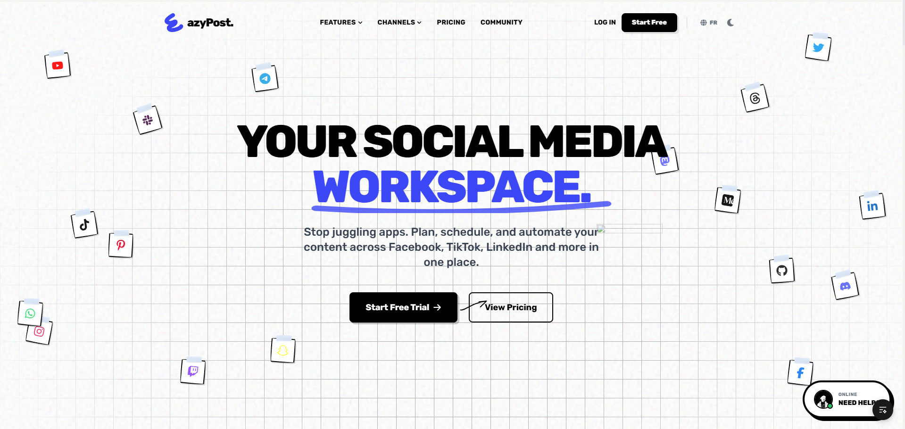
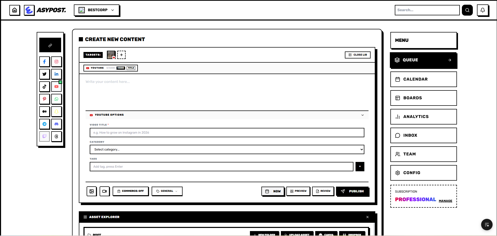
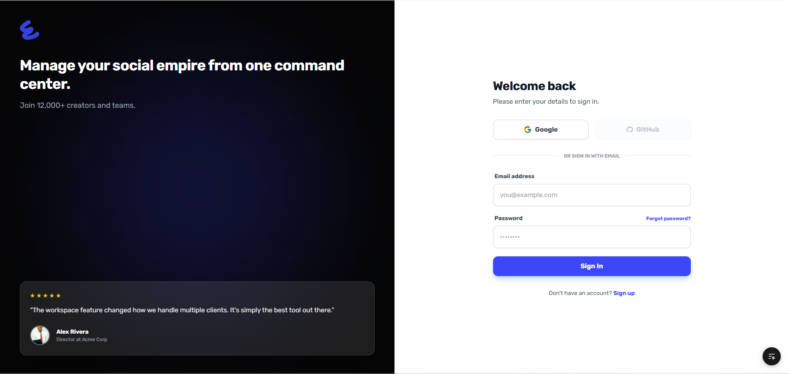

<div align="center">


# EazyPost ΓÇö Frontend

**AI-powered social media management for African creators and businesses**

[](https://github.com/gekkin-programmer/FrontendEasy/actions/workflows/ci.yml)
[](https://nextjs.org)
[](https://react.dev)
[](https://www.typescriptlang.org)
[](https://tailwindcss.com)
[](https://eazypost.cm)

[**→ Live App**](https://eazypost.cm) · [**→ Backend Repo**](https://github.com/gekkin-programmer/BackendEasy) · [**→ API Docs**](https://backend-eazypost.mbokofit.com/api-docs)

</div>

---

## Overview

EazyPost is a full-featured social media management platform built for creators and SMBs across Cameroon, Nigeria, and C├┤te d'Ivoire. Schedule, publish, and analyse content across every major platform ΓÇö from a single neubrutalist dashboard.

This repository contains the **Next.js frontend** (App Router). The NestJS backend lives in [BackendEasy](https://github.com/gekkin-programmer/BackendEasy).

---

## Screenshots

<table>
<tr>
<td width="100%">

**Landing Page**


</td>
</tr>
<tr>
<td width="100%">

**Dashboard**


</td>
</tr>
<tr>
<td width="100%">

**Login**


</td>
</tr>
</table>

---

## Features

### Publishing
- **Multi-platform scheduling** ΓÇö Facebook, Instagram, TikTok, LinkedIn, YouTube, Twitter/X, Threads, WhatsApp Business
- **AI content generation** ΓÇö GPT-powered captions, hashtag suggestions, and post rewrites
- **Calendar view** ΓÇö drag-and-drop rescheduling across a monthly/weekly grid
- **Kanban board** — manage posts through Draft → Scheduled → Published workflow
- **Media library** ΓÇö upload, organise, and reuse images & videos with GCS storage
- **Canva integration** ΓÇö import designs directly from Canva into the composer
- **Platform-specific panels** ΓÇö TikTok privacy, Instagram first-comment, YouTube description fields

### Analytics
- Per-post engagement breakdown (likes ┬╖ comments ┬╖ shares ┬╖ reach)
- Per-platform metric split with engagement rate
- AI-powered strategy insights ΓÇö best posting time, content ROI, hashtag performance
- Synced comment inbox from Facebook, Instagram, and YouTube

### Engagement (Unified Inbox)
- Multi-platform comment aggregation
- Reply to Facebook and Instagram comments from one inbox
- WhatsApp Business messaging via Embedded Signup

### Workspace & Team
- Multi-workspace support with role-based access
- Team invite flow with approval workflow
- Real-time updates via WebSocket (`AppEventsGateway`)

### Infrastructure
- Google Auth + Facebook OAuth connection
- Stripe subscription billing
- Sentry error monitoring
- PostHog product analytics
- Push notifications

---

## Tech Stack

| Layer | Technology | Version |
|---|---|---|
| Framework | Next.js (App Router) | 15.3 |
| UI Library | React | 19.2 |
| Language | TypeScript | 5 |
| Styling | Tailwind CSS + Neubrutalism | 3.4 |
| Animation | Framer Motion | 12 |
| Data Fetching | TanStack Query | 5.9 |
| Charts | Recharts | 3.6 |
| Icons | Lucide React | 0.56 |
| Date Handling | date-fns | 4.1 |
| Error Tracking | Sentry | 10.38 |
| HTTP Client | Native `fetch` (custom wrapper in `src/lib/api.ts`) | ΓÇö |
| Package Manager | **pnpm** (mandatory ΓÇö do not use npm or yarn) | 9+ |

### Design System
EazyPost uses a custom **Neubrutalist** design language:
- 2ΓÇô4 px solid borders (`border-black dark:border-white`)
- Hard box shadows (`shadow-[4px_4px_0px_0px_#000]`)
- Font: **Rubik** (entire app)
- Brand colour: `#3C48F5`
- Light background: `#F4F4F0` ┬╖ Dark background: `#000000`
- Full dark mode support via Tailwind `dark:` variants

---

## Project Structure

```
src/
Γö£ΓöÇΓöÇ app/                     # Next.js App Router pages
Γöé   Γö£ΓöÇΓöÇ dashboard/[id]/      # Main workspace dashboard
Γöé   Γö£ΓöÇΓöÇ pricing/             # Pricing page
Γöé   Γö£ΓöÇΓöÇ login/ signup/       # Auth pages
Γöé   ΓööΓöÇΓöÇ legal/               # Terms, Privacy, Cookies
Γö£ΓöÇΓöÇ components/
Γöé   Γö£ΓöÇΓöÇ easypost/            # Core dashboard components
Γöé   Γöé   Γö£ΓöÇΓöÇ Composer.tsx     # Post creation & scheduling
Γöé   Γöé   Γö£ΓöÇΓöÇ Analytics.tsx    # Analytics hub
Γöé   Γöé   Γö£ΓöÇΓöÇ CalendarView.tsx # Calendar scheduler
Γöé   Γöé   Γö£ΓöÇΓöÇ BoardView.tsx    # Kanban board
Γöé   Γöé   Γö£ΓöÇΓöÇ EngagementWithTabs.tsx  # Unified inbox
Γöé   Γöé   Γö£ΓöÇΓöÇ EasyAI.tsx       # AI assistant
Γöé   Γöé   Γö£ΓöÇΓöÇ MediaGallery.tsx # Media library
Γöé   Γöé   ΓööΓöÇΓöÇ Settings.tsx     # Workspace settings
Γöé   ΓööΓöÇΓöÇ ui/                  # Shared UI primitives (shadcn/ui)
Γö£ΓöÇΓöÇ context/
Γöé   ΓööΓöÇΓöÇ LanguageContext.tsx  # i18n ΓÇö t("EN text", "FR text")
Γö£ΓöÇΓöÇ lib/
Γöé   ΓööΓöÇΓöÇ api.ts               # Axios-free fetch wrapper (always use this)
ΓööΓöÇΓöÇ types/                   # Global TypeScript types
```

---

## Getting Started

### Prerequisites

- **Node.js** ≥ 20
- **pnpm** ≥ 9 — `npm i -g pnpm`
- A running instance of the [EazyPost Backend](https://github.com/gekkin-programmer/BackendEasy)

### Installation

```bash
# Clone the repo
git clone https://github.com/gekkin-programmer/FrontendEasy.git
cd FrontendEasy

# Install dependencies (pnpm only)
pnpm install
```

### Environment Variables

Create a `.env.local` file at the project root:

```env
# Backend API (required)
NEXT_PUBLIC_API_URL=http://localhost:3000

# App URL (required for OAuth callbacks)
NEXT_PUBLIC_APP_URL=http://localhost:3001

# Analytics (optional for local dev)
NEXT_PUBLIC_POSTHOG_PROJECT_TOKEN=
NEXT_PUBLIC_POSTHOG_HOST=https://eu.i.posthog.com

# Sentry (optional for local dev)
SENTRY_AUTH_TOKEN=
NEXT_PUBLIC_SENTRY_DSN=
```

### Running Locally

```bash
# Development server on port 3001
pnpm dev -- -p 3001
```

Open [http://localhost:3001](http://localhost:3001).

The backend must be running on port 3000. See [BackendEasy setup](https://github.com/gekkin-programmer/BackendEasy#getting-started).

### Other Commands

```bash
pnpm lint          # ESLint
pnpm test          # Jest unit tests
pnpm build         # Production build (Next.js standalone)
```

---

## CI/CD Pipeline

Every push to `dev` triggers a three-stage GitHub Actions pipeline:

```
push → dev
  Γöé
  ├─ 1. Checks  ── pnpm lint → pnpm test → pnpm build
  Γöé
  ├─ 2. Docker  ── Build image → push to ghcr.io (GitHub layer cache)
  Γöé
  └─ 3. Deploy  ── fast-forward main ← dev → Dokploy webhook → live
```

**Production infrastructure:**
- Container registry: `ghcr.io/gekkin-programmer/eazypost-frontend`
- Hosting: [Dokploy](https://dokploy.com) (self-hosted, VPS)
- Live URL: **https://eazypost.cm**

---

## Internationalization

The app ships with English and French. All strings use the `useLanguage()` hook:

```tsx
const { t } = useLanguage();

// Usage: t("English text", "Texte en français")
<p>{t("Published", "Publiée")}</p>
```

Language is stored in `localStorage` and respects browser preference on first load.

---

## API Integration

All API calls must go through `src/lib/api.ts` ΓÇö never use raw `fetch` or `axios` directly. The wrapper handles authentication headers, 401 redirects, and network errors:

```ts
import { api } from '@/src/lib/api';

// GET
const posts = await api.get<Post[]>(`/posts?workspaceId=${id}`);

// POST
const result = await api.post('/posts', { content, scheduledFor });

// With file upload
await api.upload('/media', formData);
```

---

## Contributing

1. Branch off `dev` ΓÇö never commit directly to `main`
2. Follow the existing **Neubrutalist** design conventions (see Design System above)
3. All new user-facing strings must use `t("EN", "FR")` for i18n
4. Run `pnpm lint && pnpm test` before pushing
5. Push to `dev` ΓÇö CI runs automatically and promotes to `main` on success

---

<div align="center">

Built with purpose for African creators 🌍

[eazypost.cm](https://eazypost.cm)

</div>