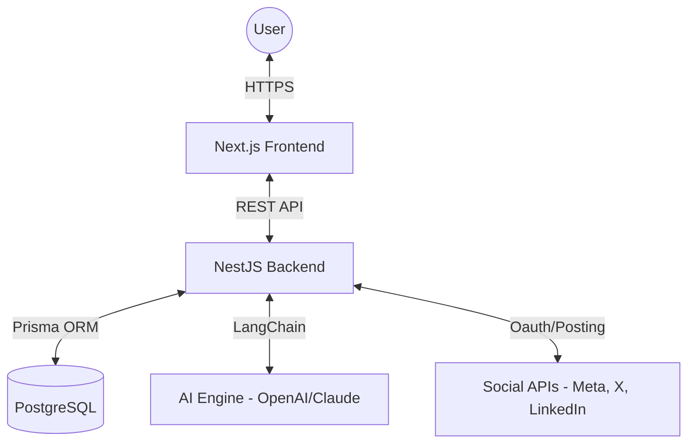

# EasyPostV2 - All-in-One Social Media Management Platform

[](https://github.com/gekkin-programmer/EasyPostV2/actions/workflows/ci.yml)
[](LICENSE)

EasyPostV2 is a professional SaaS platform designed for social media content management, team collaboration, and automated publishing. Built with a modern tech stack focusing on performance, scalability, and developer experience.

## 🌐 Production Environment

| Service | URL | Platform |
|---------|-----|----------|
| **Frontend** | [https://easyposttio.vercel.app](https://easyposttio.vercel.app) | Vercel |
| **Backend API** | [https://easypostv2.onrender.com](https://easypostv2.onrender.com) | Render |
| **API Documentation** | [https://easypostv2.onrender.com/api-docs](https://easypostv2.onrender.com/api-docs) | Swagger |
| **Database** | Neon PostgreSQL (Serverless) | Neon.tech |

---

## 🏗️ Architecture



## 🛠️ Tech Stack

### Backend (`/Nestjs_Backend`)
- **Framework**: [NestJS](https://nestjs.com/) (v11)
- **ORM**: [Prisma](https://www.prisma.io/)
- **Database**: PostgreSQL (Neon)
- **Monitoring**: [Sentry](https://sentry.io/)
- **Logging**: [Pino](https://github.com/pinojs/pino)
- **Documentation**: Swagger/OpenAPI
- **Auth**: JWT + OAuth 2.0 (Google)

### Frontend (`/frontend-next`)
- **Framework**: [Next.js 14](https://nextjs.org/) (App Router)
- **State Management**: [React Query](https://tanstack.com/query/latest)
- **Styling**: TailwindCSS + Shadcn/UI
- **Animations**: Framer Motion
- **Monitoring**: Sentry

---

## 🚀 Getting Started

### Prerequisites
- Node.js 20+
- **pnpm** (Mandatory package manager)
- A PostgreSQL database (or Neon.tech account)

### 1. Clone the repository
```bash
git clone https://github.com/gekkin-programmer/EasyPostV2.git
cd EasyPostV2
```

### 2. Backend Setup
```bash
cd Nestjs_Backend
cp .env.example .env
# Fill in your DATABASE_URL and JWT_SECRET in .env
pnpm install
pnpm prisma generate
pnpm prisma migrate dev
pnpm run start:dev
```

### 3. Frontend Setup
```bash
cd ../frontend-next
cp .env.example .env.local
# Ensure NEXT_PUBLIC_API_URL points to http://localhost:3000
pnpm install
pnpm dev -- -p 3001
```

The application will be running at `http://localhost:3001`.

---

## 🧪 Testing & CI/CD

- **Unit Tests**: `pnpm run test` (Backend)
- **E2E Tests**: `pnpm run test:e2e` (Backend)
- **Linting**: `pnpm run lint`
- **CI**: Automated workflows via GitHub Actions run on every push to `main`.

## 📂 Project Structure

- `Nestjs_Backend/`: Primary API (NestJS)
- `frontend-next/`: Primary Web App (Next.js)
- `.github/workflows/`: CI/CD Pipelines
- `backend/`: (Deprecated - for reference only)
- `frontend/`: (Deprecated - for reference only)

---

## 📝 License

© 2026 EasyPost. All rights reserved.